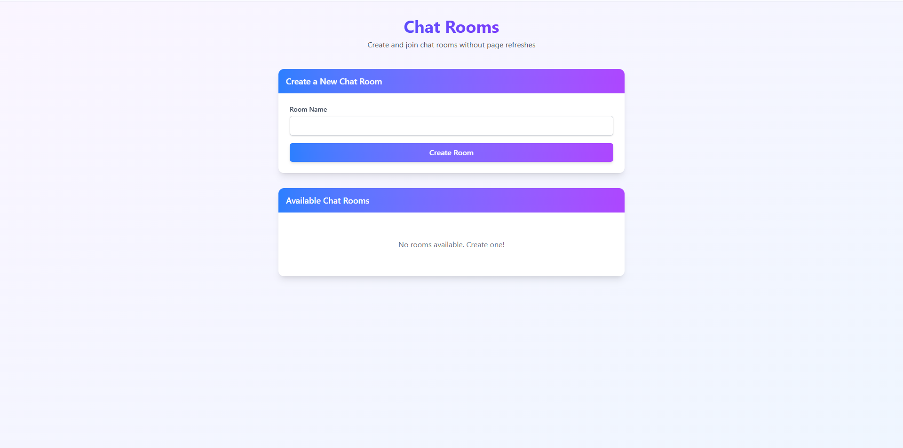

# Chat Rooms Application



A lightweight, modern chat room application that allows users to create, join, edit, and delete chat rooms without any page refreshes, built with modern web technologies.

## Technologies

This project leverages several cutting-edge technologies to provide a modern web experience:

### Core Technologies

1. **HTMX** - Powers the dynamic UI updates without JavaScript frameworks, enabling AJAX, CSS transitions, and WebSockets with simple HTML attributes
2. **JavaScript (ES6+)** - Used for application logic and DOM manipulation
3. **HTML5** - For structural markup
4. **CSS3** - For styling, enhanced with Tailwind CSS
5. **Local Storage API** - For client-side persistence of chat rooms

### Development Tools

1. **Vite** - Next-generation frontend build tool
2. **TailwindCSS** - Utility-first CSS framework
3. **Vitest** - Unit testing framework optimized for Vite

## Features

- Create new chat rooms with custom names
- View all available chat rooms
- Join existing chat rooms
- Edit rooms you've created (name management)
- Delete rooms you've created
- Responsive design for all device sizes
- Modern UI with animations and transitions
- Client-side persistence using Local Storage
- HTMX-powered interactions for a smooth user experience without page reloads

## Dependencies

### Production Dependencies

#### HTMX (v2.0.4)

A lightweight JavaScript library that allows you to access modern browser features directly from HTML, rather than using JavaScript.

**Pros:**

- Simplifies dynamic UI updates without complex JavaScript frameworks
- Reduces frontend complexity
- Works with server-rendered HTML
- Small footprint (~14KB min+gzip)
- No build step required

**Cons:**

- Not as feature-rich as full frameworks like React or Vue
- Debugging can be more challenging
- Limited community size compared to major frameworks

#### TailwindCSS (v4.0.10)

A utility-first CSS framework for rapidly building custom user interfaces.

**Pros:**

- Fast development with utility classes
- Highly customizable
- Responsive design out of the box
- Reduces need for custom CSS
- Modern aesthetics

**Cons:**

- HTML can become cluttered with utility classes
- Learning curve for developers new to utility-first CSS

#### @tailwindcss/vite (v4.0.10)

Tailwind CSS integration for Vite.

**Pros:**

- Seamless integration of Tailwind with Vite
- Optimized build process
- Hot module reloading for Tailwind classes

**Cons:**

- Specific to Vite projects

### Development Dependencies

#### Vite (v6.2.0)

A next-generation frontend build tool that significantly improves the development experience.

**Pros:**

- Extremely fast hot module replacement
- Built-in optimization for production
- ES modules native support
- Simple configuration
- Fast development server

**Cons:**

- Relatively newer compared to webpack
- Community plugins still growing

#### Vitest (v3.0.7)

A Vite-native unit testing framework with a focus on speed and developer experience.

**Pros:**

- Shares the same configuration as Vite
- Fast test execution and HMR
- Compatible with Jest's API
- Native ESM support
- Beautiful UI for test results

**Cons:**

- Newer than established tools like Jest
- Documentation not as extensive as mature testing frameworks

## Setup and Installation

### Prerequisites

- Node.js (v18 or later recommended)
- pnpm (v8 or later recommended)

### Installation Steps

1. Clone the repository

   ```bash
   git clone https://github.com/syed-asad-ul-zaman/chat-rooms.git
   cd chat-rooms
   ```

2. Install dependencies

   ```bash
   pnpm install
   ```

3. Start the development server

   ```bash
   pnpm dev
   ```

4. Open your browser and navigate to
   ```
   http://localhost:3000
   ```

## Building for Production

To create a production build:

```bash
pnpm build
```

To preview the production build locally:

```bash
pnpm preview
```

## Running Tests

This application includes comprehensive unit tests built with Vitest.

### Running All Tests

```bash
pnpm test
```

### Running Tests in Watch Mode

```bash
pnpm test -- --watch
```

### Running Tests with Coverage

```bash
pnpm test -- --coverage
```

## Application Structure

```
chat-rooms/
├── public/               # Public assets
│   └── vite.svg          # Favicon
├── src/                  # Source code
│   ├── main.js           # Main application code
│   ├── style.css         # Tailwind CSS imports
│   └── main.test.ts      # Tests for application logic
├── index.html            # Main HTML file (includes HTMX reference)
├── package.json          # Project configuration
├── vite.config.js        # Vite configuration
└── vitest.config.js      # Vitest configuration
```

## How It Works

1. **Creating Rooms**: Enter a room name and click "Create Room" to add a new chat room.
2. **Viewing Rooms**: All available rooms are displayed in the "Available Chat Rooms" section.
3. **Joining Rooms**: Click "Join Room" to enter a chat room.
4. **Editing Rooms**: If you created a room, you can click "Edit" to modify its name using HTMX modal interaction.
5. **Deleting Rooms**: If you created a room, you can click "Delete" to remove it.

## HTMX Integration

HTMX enables several modern features without complex JavaScript:

- Seamless modal interactions for editing rooms
- DOM updates without full page refreshes
- Smooth transitions and animations
- Event-driven UI updates

## Local Storage

The application uses the browser's localStorage API to persist chat room data. This means:

- Room data remains even after page refresh
- No server-side storage required
- Each browser/device will have its own set of rooms
- Clearing browser data will remove all rooms
